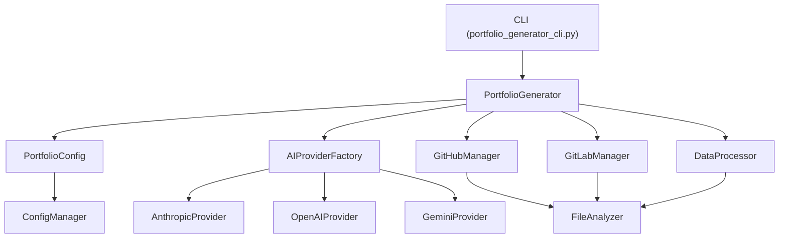

# Portfolio Generator Architecture

## Overview

The Portfolio Generator has been refactored into a modular, maintainable architecture following SOLID principles and clean code practices.

## Project Structure

```
portfolio-generator/
├── src/
│   ├── __init__.py
│   ├── portfolio_generator.py          # Main application orchestrator
│   ├── ai_providers/                   # AI provider implementations
│   │   ├── __init__.py
│   │   ├── base.py                     # Abstract base classes
│   │   ├── anthropic_provider.py       # Anthropic Claude integration
│   │   ├── openai_provider.py          # OpenAI GPT integration
│   │   ├── gemini_provider.py          # Google Gemini integration
│   │   └── factory.py                  # AI provider factory
│   ├── repository_managers/            # Repository platform handlers
│   │   ├── __init__.py
│   │   ├── base.py                     # Abstract base classes
│   │   ├── github_manager.py           # GitHub API integration
│   │   └── gitlab_manager.py           # GitLab API integration
│   ├── config/                         # Configuration management
│   │   ├── __init__.py
│   │   ├── config_manager.py           # Environment variable handling
│   │   └── portfolio_config.py         # Configuration data classes
│   └── utils/                          # Utility functions
│       ├── __init__.py
│       ├── file_analyzer.py            # File structure analysis
│       ├── data_processor.py           # Data cleaning and processing
│       └── logger.py                   # Logging configuration
├── portfolio_generator_cli.py          # Command line interface
├── portfolio_generator.py              # Legacy script (for compatibility)
├── requirements.txt                    # Dependencies
├── setup.py                           # Package configuration
└── README.md                          # Documentation
```

## Key Design Principles

### 1. Single Responsibility Principle
- Each class has a single, well-defined responsibility
- AI providers only handle AI interactions
- Repository managers only handle repository operations
- Data processors only handle data transformation

### 2. Open/Closed Principle
- Easy to add new AI providers by implementing the `AIProvider` interface
- Easy to add new repository platforms by implementing the `RepositoryManager` interface
- Existing code doesn't need modification when adding new providers

### 3. Dependency Inversion
- High-level modules don't depend on low-level modules
- Both depend on abstractions (interfaces)
- AI providers and repository managers are injected as dependencies

### 4. Interface Segregation
- Interfaces are focused and specific
- `AIProvider` only contains AI-related methods
- `RepositoryManager` only contains repository-related methods

## Component Interactions



## Benefits of the New Architecture

### 1. **Maintainability**
- Clear separation of concerns
- Easy to locate and modify specific functionality
- Reduced coupling between components

### 2. **Testability**
- Each component can be unit tested in isolation
- Easy to mock dependencies for testing
- Clear interfaces make testing straightforward

### 3. **Extensibility**
- Simple to add new AI providers
- Easy to add new repository platforms
- Minimal changes required for new features

### 4. **Error Handling**
- Specific exception types for different error categories
- Centralized error handling in the CLI
- Better error messages for users

### 5. **Configuration Management**
- Environment variables handled in one place
- Configuration validation
- Easy to add new configuration options

## Usage Examples

### Basic Usage
```bash
# Generate portfolio with default settings
python portfolio_generator_cli.py

# Check configuration
python portfolio_generator_cli.py --check-config
```

### Advanced Usage
```bash
# Use specific AI provider
python portfolio_generator_cli.py --model-provider anthropic --model-name claude-3-5-sonnet-latest

# Analyze only GitHub repositories
python portfolio_generator_cli.py --platform github --max-commits 50

# Use existing data to regenerate summary
python portfolio_generator_cli.py --use-existing
```

## Migration from Legacy Code

The legacy `portfolio_generator.py` script is still available for backward compatibility. However, users are encouraged to migrate to the new CLI:

```bash
# Old way
python portfolio_generator.py --github-username myuser

# New way
python portfolio_generator_cli.py --github-username myuser
```

## Future Enhancements

### Planned Features
1. **Plugin System**: Allow third-party AI providers and repository managers
2. **Caching**: Add intelligent caching for API responses
3. **Parallel Processing**: Implement concurrent repository processing
4. **Web Interface**: Add a web-based UI for non-technical users
5. **Template System**: Customizable portfolio templates

### Technical Improvements
1. **Async Support**: Convert to async/await for better performance
2. **Database Integration**: Optional database storage for large datasets
3. **Configuration Files**: Support for YAML/JSON configuration files
4. **Monitoring**: Add metrics and health checks
5. **Docker Support**: Containerized deployment options

## Contributing

When contributing to this project:

1. Follow the existing architecture patterns
2. Add appropriate unit tests for new components
3. Update documentation for new features
4. Ensure backward compatibility where possible
5. Follow the coding standards (use `black` for formatting)

## Performance Considerations

- API rate limiting is handled automatically
- JSON size optimization for large datasets
- Memory-efficient processing of large repositories
- Configurable commit limits to control processing time

## Security Features

- No hardcoded secrets or API keys
- Environment variable validation
- Secure handling of API responses
- Input validation for all user inputs